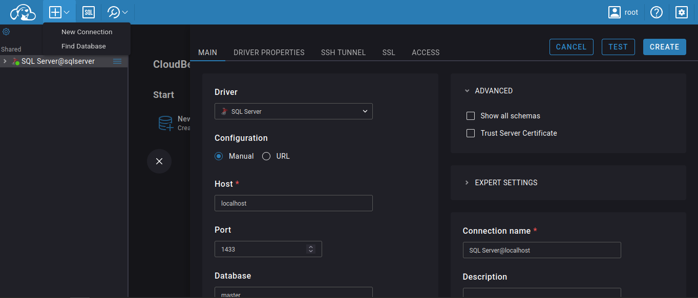
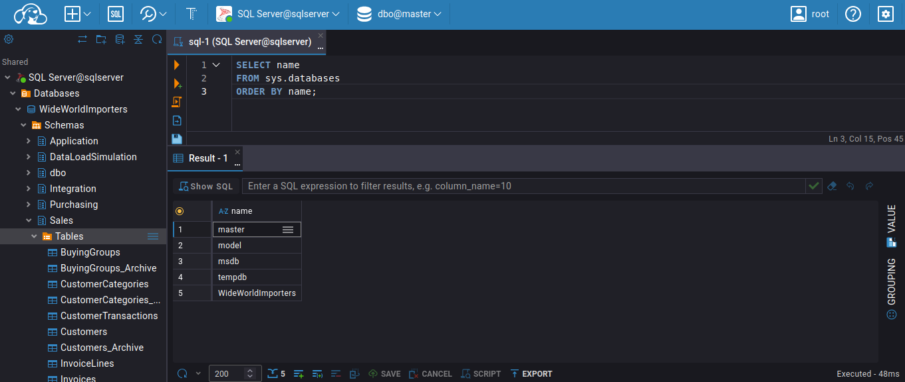

| [< Cover](../) |

---

# 01. Explore dataset


## 1.1. Simulate an ERP

<p>Before starting doing analysis we need an appropriated server to run the application to host the data simulating a real transactional system. </p>
<p>We gonna perform the following steps:</p>

* get data
* create a docker-compose
    * a container to run SQL server as a datasource
    * a container to run an aplication of dbeaver to interact with the datasource
* connect dbeaver
* restore data into our database

### 1.1.1. Get data 

<p>The data we are working with is a knon sample called WideWorldImporters from Microsoft. It's a fictional data used to demonstrate applications in SQL Server</p>
<p>This data simulate a basic relational database of a ditribution company.</p>
<p>As it's a popular dataset there exists many sources. We gonna take it from the github repo: <a href="https://github.com/Microsoft/sql-server-samples">SQL Server Samples</a>. </p> 

```bash
# save the .bak file in the current directory

wget https://github.com/Microsoft/sql-server-samples/releases/download/wide-world-importers-v1.0/WideWorldImporters-Full.bak
```

### 1.1.2. Run applications in Docker 
<p>Docker is the tool for isolate applications satisfying it's dependences. Basically is a more secure and reproducible way to get things done.</p>

<p> To make it happend we need a file .yml to configure owr enviroment <a href="./docker-compose.yml">docker-compose.yml</a>
</p>

<p>In this file we may find configuration parameters to define: </p>

* SQL Server container
    * database volume to keep the data even if the docker get down
    * backup volume to access the .bak file for restore operation
    * connections parameters of the database
* DBeaver container as a better way to access database
    backup volume to save credentials
* Network to make possible both applications interact

<p>Once the configuretion file is done we only have to command to run docker: </p>

```bash
# this command build up an run docker
    # it should be used in same directory the .yml is

docker-compose up -d
```

<p>Now both containers are running in different ports.</p>

### 1.1.3. Connect DBeaver with SQL Server

<p> To acces DBeaver Cloud we need to open the browser and get the address baset in the configured port.</p>

```bash
# to get info about the running containers

docker ps
```
<p> Once in the DBeaver web we need two little condigurations to access the database.</p>

#### A. Configure the access to DBeaver

<p>It's the easiest part. Only choose a username and password.</p>


#### B. Define the connection with SQL Server

<p>Now we need to create a connection with the database.</p>



<p>We need the following parameters:
</p>

* Driver = sqlserver
* Host = sqlserver (container name)
* Port = 1433 (defined in docker)
* User name = sa
* Password = Teste1234_ (defined in docker) 

<p>Now we can perform SQL commands to interact with the SQL server.</p>

### 1.1.4. Restore data usin .bak

<p>.bak files are backups formats for databases. Once the file accessible for our SQL Server container (defined in docker-compose), we may operate a restoration process </p>

<p>First we discover the logic names inside the .bak . </p>

```sql
-- discover the logic names
RESTORE FILELISTONLY
FROM DISK = '/var/opt/mssql/backup/WideWorldImporters-Full.bak';
```

<p>Second we run the restoration command. </p>

```sql
--restore database using .bak
RESTORE DATABASE WideWorldImporters
FROM DISK = '/var/opt/mssql/backup/WideWorldImporters-Full.bak'
WITH
MOVE 'WWI_Primary'
    TO '/var/opt/mssql/data/WideWorldImporters.mdf',

MOVE 'WWI_UserData'
    TO '/var/opt/mssql/data/WideWorldImporters_UserData.ndf',

MOVE 'WWI_Log'
    TO '/var/opt/mssql/data/WideWorldImporters.ldf',

MOVE 'WWI_InMemory_Data_1'
    TO '/var/opt/mssql/data/WideWorldImporters_InMemory_Data_1',

REPLACE,
STATS = 10;

```

<p> Now we may use SQL to get data from our dataset. </p>


```sql
-- check if the database is created
    --look for the name: WideWorldImporters

SELECT name
FROM sys.databases
ORDER BY name;

```

<p>OBS: In DBeaver cloud, if the left tree doesn't update with the new database try to reconnect the app.</p>

 

## 1.2. Data Exploration

* Understand the data and relationships
* Perform an explanatory analysis
* Answer some business questions with some SQL

 
### 1.2.1. Business questions

* Here we can find some SQL queries to better understand the dataset.
    * [Questions summary](./businessQuesrions/businessQuestions.md)
* The questions are organized in levels: 
    * [Level 1](./businessQuesrions/BusinessQuestions_L1.md) - Basic
    * [Level 2](./businessQuesrions/BusinessQuestions_L2.md) - Intermediate
    * [Level 3](./businessQuesrions/BusinessQuestions_L3.md) - Advanced
    * [Level 4](./businessQuesrions/BusinessQuestions_L4.md) - Data Warehouse & Dashboard Design

### 1.2.2. Schema
 ? get an image to demonstrate it ?

---
| [< Cover](../) |
